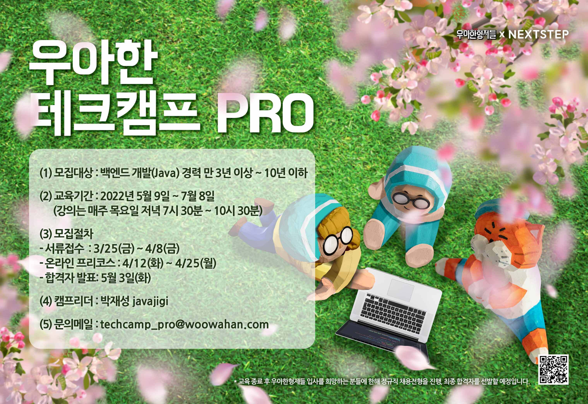

## 🏫 우아한테크캠프 프로4th 후기

👨‍💼 리더 : 넥스트스텝 박재성님

📃 내용 : 코드 리뷰를 통한 미션 수행과 어떤 개발자로 성장해 나갈 것인지를 제시하는 과정

📆 일정 : 2022년 5월 9일(화)부터 9주간 매주 목 19:30~22:30

​

## ❔ 지원동기

문제를 풀어내는 방법과 속도에 있어서 보다 나은 개발자가 되고 싶었고 지금까지의 방식에서 벗어나 새로운 방향성을 목표로 한 단계 더 성장하고 싶었습니다.    

많은 교육 과정이 있지만 우아한테크캠프는 교육만 듣고 끝나는 수업이 아닌 코드 리뷰를 통한 미션 수행과 피드백이 존재하고 좋은 프로그래밍 습관을 기를 수 있다는 점에서 적절한 교육 과정이라고 생각하여 지원하게 되었습니다.

​

## 🏎️ 프리코스

✔️ 1주차 : 숫자 야구 게임 : [미션 설명](docs/step0/baseball/readme.md), [내용 정리](docs/step0/baseball/mvc.md)

✔️ 2주차 : 자동차 경주 게임 : [미션 설명](docs/step0/racingcar/readme.md)

​

## 💡 주차별 미션

✔️ 1주차 : 학습 테스트 실습 : [미션 설명](docs/step1/study/readme.md), [내용 정리](docs/step1/study/summary.md)

✔️ 1주차 : 문자열 덧셈 계산기 : [미션 설명](docs/step1/calculator/readme.md), [내용 정리](docs/step1/calculator/summary.md)

✔️ 1주차 : TDD 기반 로또 구현 : [미션 설명](docs/step1/lotto/readme.md), [내용 정리](docs/step1/lotto/summary.md)

✔️ 2주차 : JPA : [실습1](docs/step2/subway/handson1.md), [실습2](docs/step2/subway/handson2.md), [내용 정리](docs/step2/subway/summary.md)

✔️ 2주차 : 질문 삭제하기 리팩토링 : [미션 설명](docs/step2/qna/readme.md), [내용 정리](docs/step2/qna/summary.md)

✔️ 3주차 : 인수 테스트 주도 개발 : [미션 설명](docs/step3/readme.md), [내용 정리](docs/step3/summary.md)

✔️ 4주차 : 그럴듯한 서비스 만들기 : [미션 설명](docs/step4/readme.md), [내용 정리](docs/step4/summary.md)

✔️ 5주차 : 인수 테스트 기반 TDD : [미션 설명](docs/step5/readme.md), [내용 정리](docs/step5/summary.md), [도메인 정리](docs/step5/domain.md)

✔️ 6주차 : 서비스 진단하기 : [미션 설명](docs/step6/readme.md)

✔️ 7주차 : 레거시 코드 리팩토링

✔️ 8주차 : 안정적인 서비스 만들기

​

# 🎓 수료증

