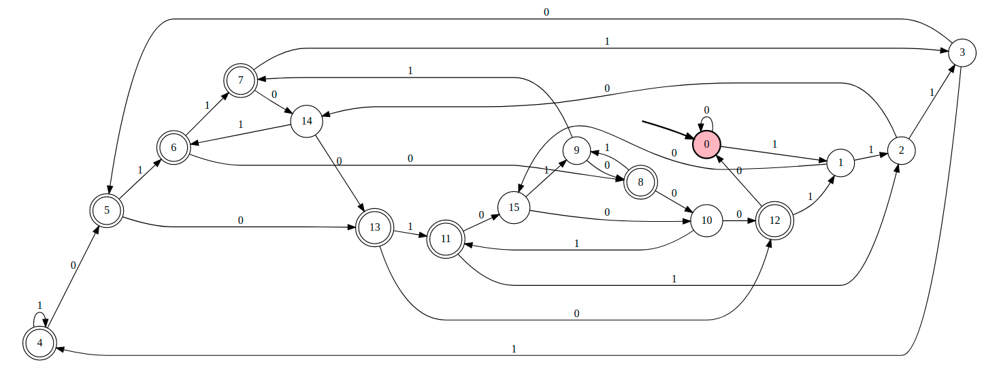

### ✏️ 커밋 메시지

커밋 메시지는 작업한 내용에 대한 이해가 가능하도록 작성한다.

***커밋 메시지 구조***

```
<type>(<scope>): <subject>      -- 제목 줄
<blank line>                    -- 빈 줄
<body>                          -- 본문
<blank line>                    -- 빈 줄
<footer>                        -- 바닥 글
```

type은 커밋의 성격을 나타내며 scope는 변경된 위치를, subject에는 간단하게 요약해서 적는다.

```
feat : 새로운 기능에 대한 커밋
fix : 버그 수정에 대한 커밋
build : 빌드 관련 수정에 대한 커밋
chore : 그 외 자잘한 수정에 대한 커밋
ci : CI 관련 설정 수정에 대한 커밋
docs : 문서 수정에 대한 커밋
style : 코드 스타일 혹은 포맷 등에 관한 커밋
refactor : 코드 리팩토링에 대한 커밋
test : 테스트 코드에 대한 커밋
```

body는 헤더에서 생략한 내용을 상세하게 작성합니다. 헤더로 충분한 표현이 가능하다면 생략이 가능하다.

footer는 선택 사항이므로 모든 커밋에 작성할 필요 없고 어떤 이슈에서 왔는지와 같은 참조 정보를 추가하는 용도로 사용한다.

### ✏️ 불필요한 객체 생성을 피하라

생성 비용이 큰 객체가 있다면 매번 생성하기 보다는 객체 하나를 재사용하는 것이 훨씬 빠르고 효율적이다.

특히 Pattern은 입력받은 정규표현식에 해당하는 유한 상태 머신(finite state machine)을 만들기 때문에 인스턴스 생성 비용이 높다.

> String.matches() 메서드는 Pattern.matches()를 이용하는데 Pattern.matches() 내부에서 Pattern 객체를 생성(compile)한 후 Matcher와 비교한 후 바로 GC 대상으로 바꿔버리기 때문이다.

미리 컴파일해두고 사용하면 비용을 줄일 수 있지 않을까?

```
import java.util.regex.Pattern;

public class StringRegex {
    private static final Pattern INVALID_STRING_PATTERN = Pattern.compile("[a-zA-Z가-힣]+");

    public static boolean isInvalid(String input) {
        return INVALID_STRING_PATTERN.matcher(input)
                                     .find();
    }
}
```

유한 상태 머신을 간단하게 설명하면:

1. 시작, 도착 상태를 포함한 상태들 (그래프에서의 노드)
2. 상태 사이의 전이 (그래프에서의 엣지)로 이루어져 있는데
   
쉽게 예를 들어 "squid"라는 패턴을 입력 문자열이 포함하고 있는지 확인하려면:

- 아직 아무 문자도 보지 못한 상태에서 시작
- 's'라는 문자를 보면 's'를 본 상태로 전이
- 'q'를 보게 되면 'sq'까지 본 상태로 전이되지만 'q'가 아닌 다른 문자를 보게 되면 아직 아무 문자도 보지 못한 상태로 전이
- 입력 문자열을 모두 소진할 때까지 반복...



이렇게 됩니다... 일반적인 탐색 문제와는 다르게 모든 상태와 전이를 찾아놓고 매칭을 하기 때문에 생성비용이 높지만 생성 이후에는 매칭을 빠르게 할 수 있기 때문에 컴파일러를 만들 때 꼭 사용되는 개념입니다.

Java Pattern와 연결지어 생각해보자면 Pattern 객체를 사용할 때 한 번 compile()하고 반복적으로 사용할 수 있는 시나리오에서 사용하는 것이 좋습니다.

[출처](https://github.com/java-squid/effective-java/issues/6#issuecomment-696519565)

### ✏️ Class and method visibility

Test Class : any top-level class, static member class, or @Nested class

Test Method : @Test, @RepeatedTest, @ParameterizedTest, @TestFactory, or @TestTemplate.

Lifecycle Method : @BeforeAll, @AfterAll, @BeforeEach, or @AfterEach.

Test classes, test methods, and lifecycle methods는 public으로 선언할 필요는 없지만 private으로 지정하면 안 된다.

일반적으로 어떤 특별한 이유가 없는 이상(다른 패키지로 확장한다든지, 테스트가 심플해진다든지) public 접근 제어자는 생략하는 편이다.

### ✏️ 구현 순서도 convention이다

클래스의 구현 순서에 대한 convention을 지키는 것도 읽기 좋은 코드를 구현하는데 의미가 있다.

클래스의 구현 순서를 지키면서 프로그래밍한다.

```
class A {
    상수 (static final) 또는 클래스 변수
    
    인스턴스 변수
    
    생성자
    
    정적 메서드
    
    메서드
    
    equals, hashCode, toString
    
    getter/setter
}
```

### ✏️ equals, hashCode, toString

모든 클래스는 최상위 클래스인 java.lang.Object 클래스를 상속 받는다. 또한, Object의 java.lang 패키지는 컴파일러에 의해 자동으로 import되기 때문에 어디에서든 사용될 수 있다.

모든 클래스는 Object의 자식이거나 자손인 클래스로 정의할 수 있기 때문에 Object 클래스에 있는 대표적인 메서드를 아는 것이 중요하다.

***equals*** : == 연산 결과를 반환한다.

== 연산자는 객체의 참조변수를 비교하여 동일성을 비교하고 equals 메서드는 객체의 동등성을 비교하는데 각 객체의 특성에 맞게 오버라이딩해야 한다.

```
동일성 : 두 개의 객체가 완전히 같은 경우를 의미하며 주소 값이 같기 때문에 같은 객체를 가리키게 된다.
동등성 : 두 개의 객체가 같은 정보를 갖고 있음을 의미하며 주소가 서로 다르더라도 내용만 같으면 동등하다고 할 수 있다.
```

동등성 검사 시, equals 메서드는 해시코드를 사용하여 객체를 비교하는 hashCode 메서드에 비해 느리므로, 좀 더 빠른 성능을 위해서는 hashCode 메서드를 먼저 사용해야 하고 클래스를 구현할 때 hashCode와 equals 메서드를 적절히 오버라이딩할 필요가 있다.

***hashCode*** : 객체를 식별할 수 있는 값을 반환한다.

객체의 메모리 주소를 이용해서 해시코드를 만들기 때문에 객체마다 다른 값을 가지고 있고 String 클래스는 문자열의 내용이 같으면 동일한 해시코드를 반환하도록 오버라이딩되어 있다.

***toString*** : 객체의 문자 정보를 반환한다.

객체의 문자 정보란 객체를 문자열로 표현한 값을 말하는데 클래스명 + '@' + 16진수 형태의 해시코드 문자열로 구성되어 있다.

### ✏️ 다양한 생성자 활용

문자열 형태의 숫자를 파라미터로 갖는 생성자를 제공하면 불필요한 메서드 호출이 줄어들고 한 곳에서 로직을 수정 관리할 수 있지 않을까?

```
public class Number {
    private static final String NEGATIVE_NUMBERS_ARE_NOT_ALLOWED = "음수는 허용되지 않습니다.";

    private final int number;

    public Number(final int number) {
        if (number < 0) {
            throw new IllegalArgumentException(NEGATIVE_NUMBERS_ARE_NOT_ALLOWED);
        }
        this.number = number;
    }

    public Number(final String number) throws NumberFormatException {
        this(readInt(number));
    }

    private static int readInt(String input) {
        return Integer.parseInt(input);
    }
    
    ...
}
```
