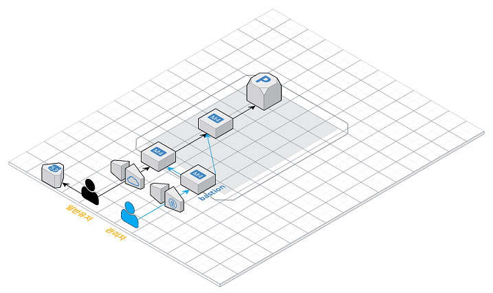

### 🎯 학습 목표

- AWS 상에서 네트워크를 구성하며, 네트워크 기본 개념들을 학습해봅니다.
- 컨테이너를 학습하고 3 tier로 운영환경을 구성해봅니다.
- 개발 환경을 구성해보고 지속적 통합을 경험해봅니다.

---

### 1. 서비스 구성하기

✏️ 요구사항
- 웹 서비스를 운영할 네트워크 망 구성하기
- 웹 애플리케이션 배포하기

📌 망 구성
- VPC 생성
    - CIDR은 C class(x.x.x.x/24)로 생성. 이 때, 다른 사람과 겹치지 않게 생성
- Subnet 생성
    - 외부망으로 사용할 Subnet : 64개씩 2개 (AZ를 다르게 구성)
    - 내부망으로 사용할 Subnet : 32개씩 1개
    - 관리용으로 사용할 Subnet : 32개씩 1개
- Internet Gateway 연결
- Route Table 생성
- Security Group 설정
    - 외부망
        - 전체 대역 : 8080 포트 오픈
        - 관리망 : 22번 포트 오픈
    - 내부망
        - 외부망 : 3306 포트 오픈
        - 관리망 : 22번 포트 오픈
    - 관리망
        - 자신의 공인 IP : 22번 포트 오픈
- 서버 생성
    - 외부망에 웹 서비스용도의 EC2 생성
    - 내부망에 데이터베이스용도의 EC2 생성
    - 관리망에 베스쳔 서버용도의 EC2 생성
    - 베스쳔 서버에 Session Timeout 600s 설정
    - 베스쳔 서버에 Command 감사로그 설정

📌 웹 애플리케이션 배포
- 외부망에 [웹 애플리케이션](https://github.com/next-step/infra-subway-deploy) 을 배포
- DNS 설정

[답변](network.md)

---

### 2. 서비스 배포하기

✏️ 요구사항
- 운영 환경 구성하기
- 개발 환경 구성하기

요구사항 설명

📌 운영 환경 구성하기
- 웹 애플리케이션 앞에 Reverse Proxy 구성하기
    - 외부망에 Nginx로 Reverse Proxy를 구성
    - Reverse Proxy에 TLS 설정
- 운영 데이터베이스 구성하기

📌 개발 환경 구성하기
- 설정 파일 나누기
    - JUnit : h2, Local : docker(mysql), Prod : 운영 DB를 사용하도록 설정

[답변](nginx.conf)

---

### 3. 배포 스크립트 작성하기

✏️ 요구사항
- 배포 스크립트 작성하기
    - 반복적으로 실행하더라도 정상적으로 배포하는 스크립트를 작성해봅니다.
    - 기능 단위로 함수로 만들어봅니다.
    - 스크립트 실행시 파라미터를 전달해봅니다.

[답변](deploy.sh)
