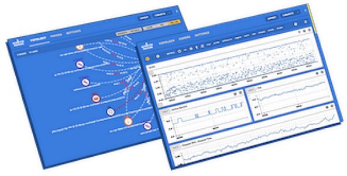

### 🎯 학습 목표

- USE 방법론을 활용하여 서버를 진단할 수 있고 쓰레드 덤프를 확인해봅니다.
- webpageteat, pagespeed를 활용하여 웹 성능 예산을 고민해봅니다.
- 목표치를 정하고 부하테스트를 직접 수행해봅니다.

---

### 1. 웹 성능 테스트

✏️ 요구사항
- 웹 성능 테스트
  - 웹 성능 예산을 작성
  - [WebPageTest](https://www.webpagetest.org/), [PageSpeed](https://pagespeed.web.dev/) 등 테스트해보고 개선이 필요한 부분을 파악

[답변](performance.md)

---

### 2. 부하 테스트

✏️ 요구사항
- 부하 테스트
  - 테스트 전제조건 정리
  - 대상 시스템 범위
  - 목푯값 설정 (latency, throughput, 부하 유지기간)
  - 부하 테스트 시 저장될 데이터 건수 및 크기
- 각 시나리오에 맞춰 스크립트 작성
  - 접속 빈도가 높은 페이지
  - 데이터를 갱신하는 페이지
  - 데이터를 조회하는데 여러 데이터를 참조하는 페이지
- Smoke, Load, Stress 테스트 후 결과를 기록

[답변](test.md)

---

### 3. 로깅, 모니터링

✏️ 요구사항
- 애플리케이션 진단하기 실습을 진행해보고 문제가 되는 코드를 수정
- 로그 설정하기
- Cloudwatch로 모니터링

[답변](logging.md)
