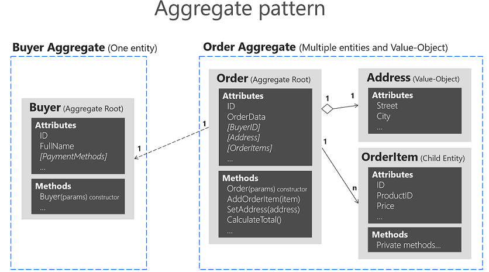

### ✏️ 키친포스

레거시 코드를 리팩터링하기 전 요구사항을 정리하고 테스트 코드를 작성한다.
- 안정적으로 리팩터링할 수 있다.
- 도메인 지식을 얻을 수 있다.

🧰 요구사항 정리

<details>
<summary>단체 지정</summary>
<br>

```
- 개별 주문 테이블을 그룹화할 수 있다. 
    * 주문 테이블은 최소 2개 이상이어야 한다.
    * 빈 테이블이 아니거나 이미 그룹화된 테이블은 사용할 수 없다.
- 주문 테이블 번호가 올바르지 않으면 등록할 수 없다.
    * 주문 테이블 번호는 실제로 존재하는 값이어야 한다.
- 단체 지정 테이블에 생성일자를 기록한다.
- 각각의 주문 테이블에 단체 번호를 부여한다. 
- 각각의 주문 테이블은 주문을 등록할 수 있는 상태로 변경한다.
- 그룹화된 주문 테이블 목록을 결과를 조회할 수 있다.
```
</details>

<details>
<summary>단체 지정 취소</summary>
<br>

```
- 단체 지정 테이블을 개별 주문 테이블로 변경할 수 있다.
- 단체로 지정된 주문 테이블을 조회한다.
- 주문 상태가 조리 또는 식사인 경우 개별 주문 테이블로 변경할 수 없다.
- 각각의 주문 테이블에 부여된 단체 번호를 삭제한다.
```
</details>

<details>
<summary>주문 테이블</summary>
<br>

```
- 초기 주문 테이블을 등록할 수 있다.
- 모든 주문 테이블을 조회할 수 있다.
- 주문 테이블을 빈 테이블로 변경할 수 있다.
    * 테이블이 단체 지정된 경우 변경할 수 없다.
    * 주문 상태가 조리 또는 식사인 경우 변경할 수 없다.
```
</details>

<details>
<summary>방문한 손님 수</summary>
<br>

```
- 주문 테이블에 방문한 손님 수를 기록할 수 있다.
    * 방문한 손님 수가 0 보다 작을 수는 없다.
    * 주문 테이블 번호는 실제로 존재하는 값이어야 한다.
    * 주문 테이블이 빈 테이블이 아니어야 한다.
```
</details>

<details>
<summary>메뉴 그룹</summary>
<br>

```
- 메뉴 그룹을 등록할 수 있다.
- 모든 메뉴 그룹을 조회할 수 있다.
```
</details>

<details>
<summary>메뉴</summary>
<br>

```
- 메뉴를 등록할 수 있다.
    * 메뉴 가격은 0원 이상이어야 한다.
    * 메뉴 그룹 번호는 실제로 존재하는 값이어야 한다.
    * 상품 번호는 실제로 존재하는 값이어야 한다.
    * 메뉴 가격이 상품 가격 * 수량의 합계와 일치하는지 확인한다.
- 메뉴를 조회할 수 있다.
```
</details>

<details>
<summary>상품</summary>
<br>

```
- 상품을 등록할 수 있다.
    * 상품 가격은 0원 이상이어야 한다.
- 모든 상품을 조회할 수 있다.
```
</details>

<details>
<summary>주문</summary>
<br>

```
- 주문을 등록할 수 있다.
    * 메뉴 번호는 실제로 존재하는 값이어야 한다.
    * 테이블은 주문을 등록할 수 없는 빈 테이블이 아니어야 한다.
- 주문에 테이블 번호를 부여한다.
- 주문 상태를 조리로 변경한다.
- 주문 테이블에서 요청된 주문 항목에 주문 번호를 부여한다.
- 모든 주문을 조회할 수 있다.
- 주문 상태를 변경할 수 있다.
    * 계산 완료된 주문은 변경할 수 없다.
```
</details>

🧰 테이블 설명

<details>
<summary>메뉴</summary>
<br>

```
- menu_group : 메뉴를 하나로 묶어주는 단위를 관리하는 테이블
- menu : 메뉴를 관리하는 테이블
- menu_product : 메뉴, 상품 연결 테이블, 상품 수량을 추가함
```
</details>

<details>
<summary>상품</summary>
<br>

```
- product : 메뉴를 구성하는 상품을 관리하는 테이블
```
</details>

<details>
<summary>테이블</summary>
<br>

```
- table_group : 개별 주문 테이블을 하나로 묶어주는 단위를 관리하는 테이블
- order_table : 단체 번호, 방문한 손님 수, 주문 등록 상태를 관리하는 테이블
```
</details>

<details>
<summary>주문</summary>
<br>

```
- orders : 테이블 번호, 주문 상태를 관리하는 테이블
- order_line_item : 주문, 메뉴 연결 테이블 테이블, 주문 수량을 추가함
```
</details>

🧪 테스트 코드

<details>
<summary>Mockito</summary>
<br>

```
package kitchenpos.application;

import ...

@ExtendWith(MockitoExtension.class)
class MenuServiceTest {
    ...
    
    @DisplayName("메뉴를 생성한다.")
    @Test
    void create() {
        // given
        given(menuGroupDao.existsById(anyLong())).willReturn(true);
        given(productDao.findById(anyLong())).willReturn(Optional.of(product));
        given(menuDao.save(any(Menu.class))).willReturn(new Menu.Builder().id(1L).build());
        given(menuProductDao.save(any(MenuProduct.class))).willReturn(new MenuProduct.Builder().seq(1L).build());

        // when
        Menu created = menuService.create(menu);

        // then
        assertThat(created.getId()).isNotNull();

        // verify
        then(menuGroupDao).should(times(1)).existsById(anyLong());
        then(productDao).should(times(2)).findById(anyLong());
        then(menuDao).should(times(1)).save(any(Menu.class));
        then(menuProductDao).should(times(2)).save(any(MenuProduct.class));
    }
    
    @DisplayName("메뉴를 구성하는 상품의 가격 * 수량의 합계는 메뉴 가격과 일치해야 한다.")
    @Test
    void create_throwsException_ifWrongPrice() {
        // given
        given(menuGroupDao.existsById(anyLong())).willReturn(true);
        given(productDao.findById(anyLong())).willReturn(Optional.of(product));

        // when
        Menu menu = new Menu.Builder("점심특선", 4000, menuGroup.getId(), menuProducts).build();

        // then
        assertThatThrownBy(() -> menuService.create(menu)).isInstanceOf(IllegalArgumentException.class);

        // verify
        then(menuDao).should(never()).save(any(Menu.class));
    }
}
```
</details>

### ✏️ 의존성 리팩토링

📼 추천 영상

[우아한객체지향 by 우아한형제들 개발실장 조영호님](https://www.youtube.com/watch?v=dJ5C4qRqAgA)

[도메인 원정대 #우아콘2021](https://www.youtube.com/watch?v=kmUneexSxk0)

🧰 메뉴 정보가 변경되면 참조에 의해서 관련 정보가 변경될 수 있다.

<details>
<summary>주문 항목</summary>
<br>

```
package kitchenpos.domain;

import ...

@Entity
public class OrderLineItem {
    @Id
    @GeneratedValue(strategy = GenerationType.IDENTITY)
    private Long seq;
    private Long menuId;
    // 메뉴의 이름과 가격이 변경되더라도 주문 금액은 변함이 없어야 한다.
    private String menuName;
    private BigDecimal price;    
    private long quantity;
    
    ...
```
</details>

🧰 Aggregate

- 관련 객체를 하나로 묶은 군집으로 동일한 라이프 사이클을 가지고 있다.
- 애그리거트는 군집에 속한 객체들을 관리하는 루트 엔티티를 갖는다.
- 한 애그리거트에 속한 객체는 다른 애그리거트에 속하지 않는다.

<details>
<summary>Aggregate pattern</summary>



애그리거트 루트
- 애그리거트의 일관성이 깨지지 않도록 한다.
- 애그리거트가 제공해야 할 도메인 기능을 구현한다.
- 애그리거트의 내부 구현을 숨겨서 애그리거트 단위로 캡슐화한다.

애그리거트 참조
- id 참조를 사용하면 모든 객체가 참조로 연결되지 않고 복잡도를 낮추는 것과 함께 다른 애그리거트를 수정하는 문제를 원천적으로 방지할 수 있다.

</details>

🧰 의존 역전 원칙

<details>
<summary>고수준 모듈, 저수준 모듈</summary>

고수준 모듈
- 어떤 의미 있는 단일 기능을 제공하는 모듈

저수준 모듈
- 고수준 모듈의 기능을 구현하기 위해 필요한 하위 기능의 실제 구현

고수준 모듈의 의존 문제
- 고수준 모듈이 저수준 모듈을 의존한다.
- 저수준 모듈의 변경에 따라 고수준 모듈이 영향을 받는다.
- 고수준 모듈만 테스트하기 어렵다.
- 다른 구현 기술을 사용하려면 코드의 많은 부분을 고쳐야 한다.

💡 DIP
- 저수준 모듈이 고수준 모듈에 의존한다고 해서 이를 Dependency Inversion Principle이라고 한다.
- 고수준 모듈은 더 이상 저수준 모듈에 의존하지 않고 구현을 추상화한 인터페이스에 의존한다.
- 하위 기능을 추상화한 인터페이스는 고수준 모듈 관점에서 도출한다.
- 추상화한 인터페이스는 저수준 모듈이 아닌 고수준 모듈에 위치한다.
</details>

### ✏️ 멀티 모듈

🧰 프로젝트 설정

settings.gradle
```
rootProject.name = 'kitchenpos'
include 'menu'
include 'table'
include 'order'
```

build.gradle
```
...

subprojects {
    apply plugin: 'java'
    ...
}

dependencies {
    ...
    implementation project(':menu')
    implementation project(':table')
    implementation project(':order')
}
```

🧰 모듈로 분리해본다.

<details>
<summary>Menu</summary>

#### 도메인
- MenuGroup
  - 메뉴를 하나로 묶어주는 단위
  - 단독으로 생성되고 메뉴가 등록된 경우 삭제할 수 없음

- Menu
  - 주문이 발생할 때 사용되는 대표 도메인
  - 메뉴 그룹과 상품을 참조함
  - 메뉴 가격을 추가함

- MenuProduct
  - 메뉴에 포함된 상품을 저장하고 관리함
  - 상품 수량을 추가함

- Product
  - 메뉴를 구성하는 항목
  - 상품명과 가격을 저장함

#### 서비스
- MenuService
  - 메뉴를 생성함

- MenuValidator
  - 메뉴를 생성하는 서비스를 지원함
    - 메뉴에 포함된 상품의 유효성 검사
    - 메뉴 가격와 상품 가격 * 수량의 합계 검사
    - 상품과 상품 수량을 상품 번호로 매핑함
</details>

<details>
<summary>Table</summary>

#### 도메인
- TableGroup
  - 개별 주문 테이블을 하나로 묶어주는 단위
  - 단독으로 생성되고 단체 지정 기능과 취소 기능을 가짐
    - 단체 지정, 취소 시 주문 테이블을 파라미터로 전달받음

- OrderTable
  - 방문한 손님 수, 빈 테이블 속성 파라미터로 생성됨
  - 단체 지정 시 테이블그룹 번호를 부여하고 취소 시 null 처리함

#### 서비스
- TableGroupService
  - 주문 테이블을 검사하고 테이블그룹에게 단체 지정을 요청함
  - 주문 테이블을 검사하고 테이블그룹에게 단체 지정 취소를 요청함

- TableService
  - 빈 테이블을 생성함
  - 빈 테이블 속성을 변경함
  - 방문한 손님 수를 변경함

- OrderTableValidator
  - 주문 테이블에 포함된 주문의 상태를 체크함
    - 주문 상태가 조리 또는 식사인 경우 단체 지정을 취소하거나 빈 테이블로 변경할 수 없음
</details>

<details>
<summary>Order</summary>

#### 도메인
- Order
  - 주문 관련 대표 도메인
  - 주문 항목(메뉴)을 참조함
  - 주문 상태를 저장하고 관리함
    - 주문 상태가 조리 또는 식사인지 체크함

- OrderLineItem
  - 메뉴 번호, 메뉴명, 메뉴 가격, 수량을 저장함
    - 메뉴가 변경되더라도 과거 정보는 변경되지 않음

#### 서비스
- OrderService
  - 주문을 생성함
  - 주문 상태를 변경함
</details>
