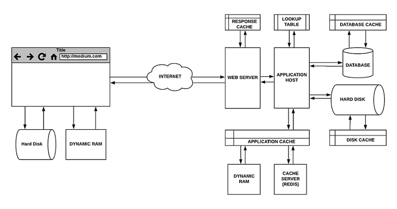

### 🎯 학습 목표

- HTTP 개선에 따른 차이를 이해하고 Reverse Proxy 성능 개선을 해봅니다.
- HTTP Cache 전략을 이해하여 적절한 정책을 설정해봅니다.
- 쿼리를 최적화하여 조회 성능을 개선해봅니다.
- 인덱스를 설정하여 조회 성능을 개선해봅니다.

---

### 1. 화면 응답 개선하기

✏️ 요구사항
- 부하테스트 각 시나리오의 요청시간을 목푯값 이하로 개선
  - 개선 전 / 후를 직접 계측하여 확인

[개선1](nginx.conf)
- gzip
- cache
- TLS, HTTP/2

[개선2](redis.md)
- Redis
---

### 2. 스케일 아웃

✏️ 요구사항
- springboot에 HTTP Cache, gzip 설정하기
- Launch Template 작성하기
- Auto Scaling Group 생성하기
- Smoke, Load, Stress 테스트 후 결과를 기록

[답변](scale.sh)
- jdk 설치
- 방화벽 설정
- nginx 실행
- 애플리케이션 배포

---

### 3. 쿼리 최적화

🍿 SQL
- [실습 사이트](https://www.w3schools.com/sql/trymysql.asp?filename=trysql_func_mysql_concat) 에서 아래 쿼리를 작성해보세요.
  - 200개 이상 팔린 상품명과 그 수량을 수량 기준 내림차순으로 보여주세요.
  - 많이 주문한 순으로 고객 리스트(ID, 고객명)를 구해주세요.
  - 많은 돈을 지출한 순으로 고객 리스트를 구해주세요.

[답변](sql-1.md)

✏️ 요구사항
- 활동중인(Active) 부서의 현재 부서관리자(manager) 중 연봉 상위 5위안에 드는 사람들이 최근에 각 지역별로 언제 퇴실(O)했는지 조회해보세요.
- 인덱스 설정을 추가하지 않고 1s 이하로 반환합니다. 

[답변](sql-2.md)

---

### 4. 인덱스 설계

✏️ 요구사항
- 주어진 데이터셋을 활용하여 아래 조회 결과를 100ms 이하로 반환 
  - [Coding as a Hobby](https://insights.stackoverflow.com/survey/2018#developer-profile-_-coding-as-a-hobby) 와 같은 결과를 반환하세요.
  - 프로그래머별로 해당하는 병원 이름을 반환하세요. 
  - 프로그래밍이 취미인 학생 혹은 주니어(0-2년)들이 다닌 병원 이름을 반환하고 user.id 기준으로 정렬하세요.
  - 서울대병원에 다닌 20대 India 환자들을 병원에 머문 기간별로 집계하세요. 
  - 서울대병원에 다닌 30대 환자들을 운동 횟수별로 집계하세요. 

[답변](sql-3.md)
